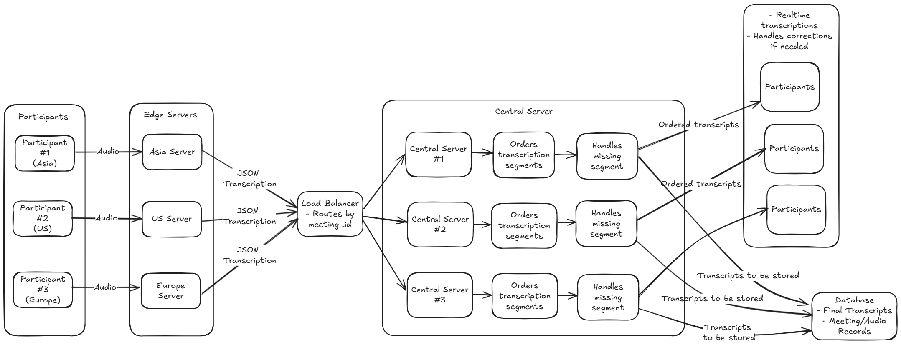

# Meeting.AI Test

# Part 1 - Real-Time Transcription WebSocket Server

A WebSocket server that provides real-time audio transcription using AssemblyAI's streaming speech-to-text service.

## Technical Specifications

### Audio Requirements

- **Format**: Raw PCM16
- **Channels**: Mono
- **Sample Rate**: 16,000 Hz
- **Delivery**: Audio chunks via WebSocket messages

### Response Format

```json
{
  "text": "transcribed text segment",
  "start": 1.25,
  "end": 3.75
}
```

Where:

- `text`: The transcribed text segment
- `start`: Start time of the segment (in seconds)
- `end`: End time of the segment (in seconds)

## Setup Instructions

### Prerequisites

- Node.js
- npm
- AssemblyAI API key (get one [here](https://www.assemblyai.com/))

### List of dependencies:

1. [AssemblyAI's Node SDK](https://www.npmjs.com/package/assemblyai)
2. [ExpressJS](https://www.npmjs.com/package/express)
3. [WebSocket](https://www.npmjs.com/package/ws)
4. [Dotenv](https://www.npmjs.com/package/dotenv)

### Installation

1. Clone the repository

```
git clone https://github.com/matthewhjt/assemblyai-realtime.git
cd assemblyai-realtime
```

2. Install dependencies

```
npm install
```

3. Environment configuration

Create .env file in the root directory:

```
ASSEMBLYAI_API_KEY=your_assemblyai_api_key_here
PORT=3000
```

### Running the Server

```
npm run dev
```

## API Documentation

1. WebSocket Endpoint

```
ws://localhost:3000
```

### Message Protocol

Client to Server

- Audio Data: Send raw PCM16 audio data as binary messages

### Server to Client

```
{
  "text": "Hello world",
  "start": 1.25,
  "end": 3.75
}
```

## Using the Test Script

A separate test script is available in the test directory that can stream audio files to your server.

# Part 2 - System Design Challenge

## The Scenario

Meeting.ai has launched a new feature allowing multiple participants to join virtual meetings from different geographic locations. Each participant's audio is processed by the nearest edge server for transcription to minimize latency.

## The Problem

During active discussions where multiple people speak rapidly or interrupt each
other, transcription segments arrive at our central server out of order.

## Design Questions

1. Message Ordering Approach

- Explain your approach to handle out-of-order messages
- What data structures and algorithms would you use?

  We could use a priority queue as the core data structure, where message timestamps serve as the priority key. This automatically maintains sorted order as out-of-order messages arrive, with O(log n) insertion/removal time.

  The priority queue works by using each message's original timestamp (when the speech actually occurred) as the sorting criteria. When transcript segments arrive from different edge servers in random order, we simply insert them into the queue and the heap property ensures they're automatically organized by chronological order. When we need to emit messages, we extract them from the queue and they come out perfectly sorted without requiring additional sorting operations.

  To handle timing constraints, we combine this with a time-window buffering approach. Each active meeting maintains its own priority queue within a sliding window buffer. We can use a 700ms window size. Using a 600-700ms window should covers most of network latency while leaving a buffer for other processing stages (considering maximum of 2 seconds delay for end-to-end performance).

  Every 700 ms, we extract all messages from the current window's priority queue (they emerge already sorted), emit them to clients via WebSocket, then clear the window and advance to the next time period. This gives late-arriving messages a reasonable opportunity to reach the server and be properly ordered, while maintaining real-time responsiveness.

2. Fault Tolerance
   - How would you handle missing segments or late arrivals?
   - What happens if an edge server goes down?

   **Missing Segments:**
   - Detect missing segments suspicious timestamp gaps between segments
   - Insert meaningful placeholders: "[Audio unclear]" or "[Connection lost]"
   - Implement post-window correction algorithm for late-arriving segments

   **Late Arrivals (beyond time-window size):**
   - Send correction messages to clients, something like "INSERT at position X"
   - Update meeting transcript in database for final record

   **Edge Server Failure:**
   - Detect via heartbeat monitoring (edge servers ping every 30s), like liveness probe in Kubernetes
   - Redirect and notify affected participants to backup edge servers
   - Mark segments from failed timeframe as "[Connection lost]"

3. Trade-offs
   - What trade-offs would you consider between latency and accuracy?
   - How would you balance real-time requirements with ordering guarantees?

   **The Window Size Dilemma:**

   The choice of 700ms window represents a carefully considered balance point. If we reduced this to 300-400ms, users would see transcripts appear much faster, creating a more responsive feel during conversations. However, this speed comes at the cost of accuracy - we'd miss more late-arriving segments from distant edge servers or those experiencing temporary network congestion, leading to more "[Audio unclear]" placeholders scattered throughout transcripts. On the other hand, extending the window to 1200-1500ms would capture nearly all out-of-order segments, producing much cleaner and more complete transcripts, but at the cost of approaching the 2-second system constraint and might make conversations feel weird or unnatural.

   **Missing Segment Response Strategy:**

   When we detect missing segments, we have two choices: wait longer to find the missing piece, or send what we have with a placeholder. We can send placeholders immediately (like "[Audio unclear]") to keep the conversation flowing, then fix the transcript later if the missing segment arrives. This means users see consistent timing but might briefly see incomplete text that gets corrected afterwards.

   **Balancing Real-time with Ordering Guarantees:**

   We can implement meeting type selection during setup, allowing clients to choose their priority: "Speed" (400ms windows for presentations), "Balanced" (700ms for interactive meetings), or "Accuracy" (1000ms for compliance recordings). This tailors the latency-accuracy trade-off to specific use cases.

   The system can also use an adaptive approach based on network conditions, automatically reducing window sizes during stable periods for faster response, and extending them when detecting high latency or packet loss. This ensures optimal performance regardless of current network quality.

   Following AssemblyAI's approach, we can also mark transcripts as "partial" or "final" to give users context. Partial results appear quickly during the window period, then get marked as final once the window closes and ordering is complete. This lets users see immediate feedback while knowing which parts might still change.

4. System Architecture
   - Draw a system architecture diagram showing data flow
   - Include all major components and their interactions

   
   View [here](https://excalidraw.com/#json=13qKpRlcj0NxSw-k1tbgu,iTSDgsizCgqpYSSgqjTPvQ)
   - Load balancer distributes meetings across multiple central servers
   - Each server handles complete processing for assigned meetings

   Data Flow:
   1. Edge Layer: Regional transcription
   2. Load Balancing: Meeting-based routing
   3. Processing: Independent ordering per server instance
   4. Storage: Database for persistence (example: PostgreSQL)
   5. Delivery: WebSocket connections to client/participants

   Scalability considerations:
   1. The edge server layer scales independently based on geographic demand, with new regions added as user base grows.
   2. We could use database replicas for read-heavy operations like historical transcript searches and meeting analytics, while keeping all writes (new transcripts, corrections) on the primary PostgreSQL instance.
   3. We could implement auto-scaling based on CPU and memory metrics using Kubernetes Horizontal Pod Autoscaler (HPA) or similar container orchestration tools.
   4. Message queuing between edge servers and central servers could use Apache Kafka, though for this use case, direct HTTP/WebSocket connections should suffice initially.
